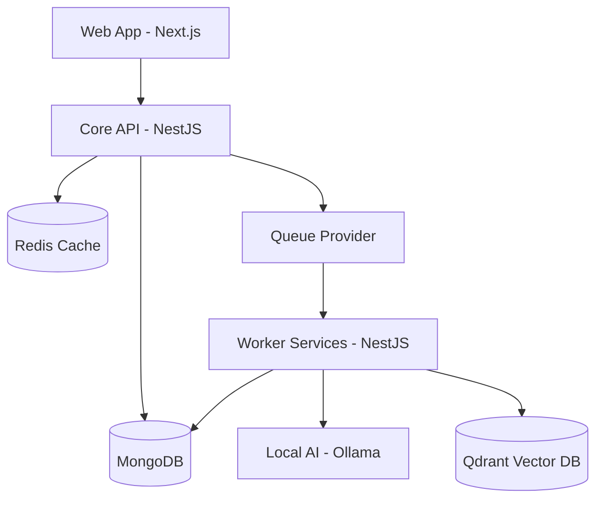

# 🧠 Recall


Recall is a robust, production-ready monorepo built for advanced document processing, AI-driven knowledge extraction, and scalable Web applications. It combines a high-performance **NestJS backend pipeline** with a modern **Next.js front-end**, all orchestrated by **Turborepo**.

## 🏗 System Architecture

Recall utilizes a service-oriented architecture, splitting responsibilities between a client-facing web app, a core API API, and a background worker.



### 📦 Applications (`apps/`)

- **`apps/web`**: Frontend Next.js 16 application. Features modern UI (TailwindCSS v4, Shadcn), React Query for state management, and strict TypeScript integration.
- **`apps/api`**: Core NestJS API handling user authentication (OAuth + JWT), document uploads, and serving data to the client. Includes Swagger/OpenAPI documentation.
- **`apps/worker`**: Dedicated NestJS background processing service. Handles resource-intensive tasks such as document parsing, chunking, and interacting with AI models (LLMs and vector embedding).

### 🧩 Shared Packages (`packages/`)

- **`@repo/ai`**: Qdrant and Ollama integrations for embeddings and AI interactions.
- **`@repo/cache`**: Redis and Upstash caching utilities.
- **`@repo/crypto`**: Security and encryption utilities.
- **`@repo/db`**: MongoDB connection handlers and Mongoose schemas.
- **`@repo/queue`**: Pluggable queue providers for background job dispatch and routing.
- **`@repo/types`**: Shared TypeScript interfaces across the monorepo.
- **`@repo/eslint-config`, `@repo/jest-config`, `@repo/typescript-config`**: Centralized configurations ensuring consistency.

## 🚀 Tech Stack

- **Frontend:** Next.js 16 (App Router), React 19, TailwindCSS v4, Shadcn UI, Framer Motion
- **Backend:** NestJS 11, Express
- **Database:** MongoDB
- **Caching & Queues:** Redis, Upstash, Queue Providers
- **AI & Vector DB:** Ollama (Local LLMs), Qdrant (Vector DB)
- **Tooling:** Turborepo, Yarn 4 (Workspaces), ESLint, Prettier, Jest

## 🛠 Getting Started

### Prerequisites

Ensure you have the following installed on your system:

- **Node.js** (v24.x recommended)
- **Yarn** (v4.5.1 configured via corepack)
- **Docker** and **Docker Compose** (for running local dependencies)

### Installation

1. Clone the repository:

   ```bash
   git clone <repository_url>
   cd recall
   ```

2. Install dependencies:

   ```bash
   yarn install
   ```

3. Start backing services via Docker (MongoDB, Redis, Qdrant, Ollama):

   ```bash
   docker compose up -d
   ```

4. Set up environment variables (copy `.env.example` to `.env` in respective apps and packages as required).

### Development

Run the entire stack in development mode:

```bash
yarn dev
```

This command will start the Next.js web app, the NestJS API, and the NestJS Worker concurrently using Turborepo.

### Operations

- `yarn build`: Builds all apps and packages.
- `yarn test`: Runs unit tests across the monorepo.
- `yarn test:e2e`: Runs end-to-end tests.
- `yarn lint`: Lints all code.
- `yarn format`: Formats code using Prettier.
- `yarn typecheck`: Runs TypeScript compiler (noEmit) to catch type errors.

## 🤝 Contributing

We welcome contributions! Please see our [Contributing Guide](./CONTRIBUTING.md) for detailed instructions on branching, coding standards, and submitting pull requests.

## 📜 License

[UNLICENSED](./LICENSE)
